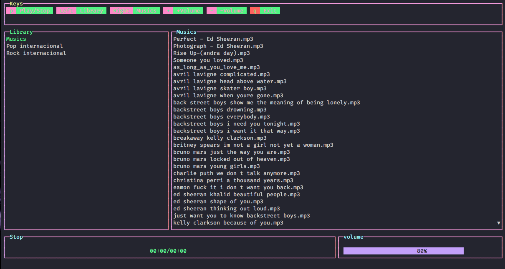

# Termplay

> :musical_note:App to play music through the terminal.

## Preview


## :tada:Install
Clone of repository
```
git clone https://github.com/informeai/termplay.git
```
Build
```
cd termplay
go build .
```
## :fire:Usage
Unix:
```
./termplay <path of musics>
```
Windows
```
termplay.exe <path of musics>
```
**or**

create archive ``.env`` in directory termplay.
write on archive:
```
PATH_MUSICS=< path of musics >
```

## :books:Libs

[termui](https://github.com/gizak/termui)

[beep](https://github.com/faiface/beep)

made with :heart: by informeai
